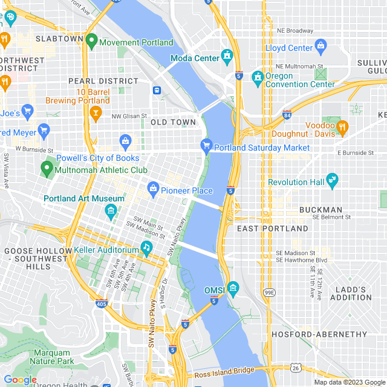
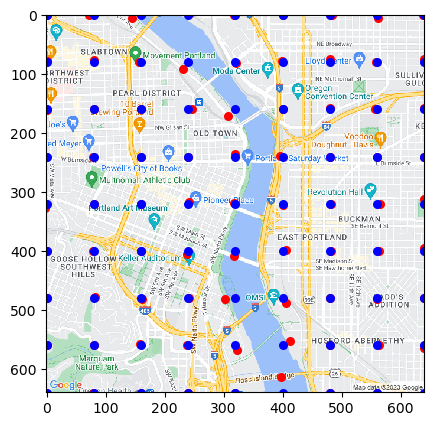
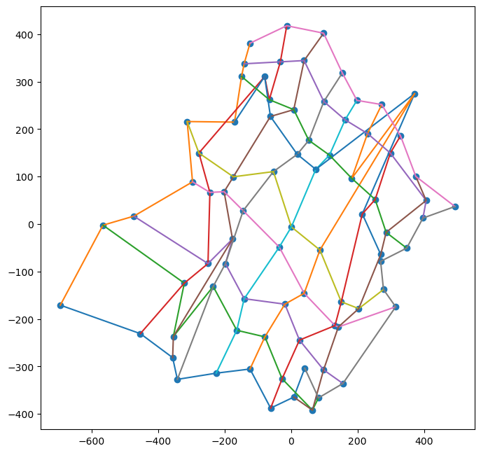
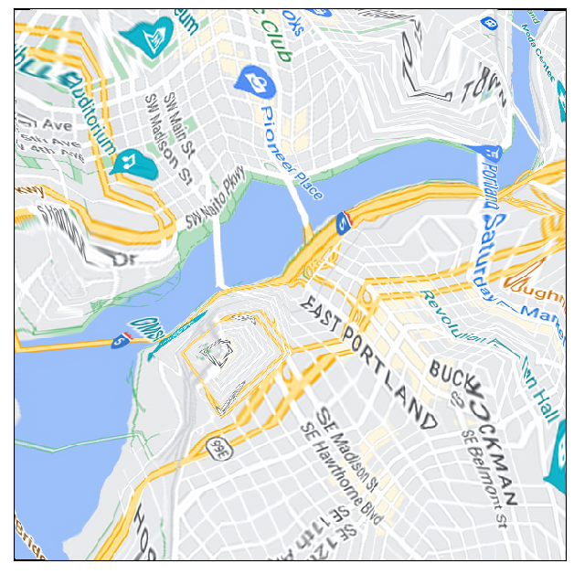

# travel-time-maps

The goal of this project is to distort physical distance maps to more accuratly reflect travel time. This might sound like an "isochrone", but those are maps that only show travel time from a single origin. We want to have a map where all distances between any pair of points depicts travel time. We should point out that this is impossible for many reasons, but how close can we get?

We start with a city map like this.

 

Then we pick out some key points and compute the pairwise travel time between them all.

Next we do some magic (currently using a machine learning algorithm but more experementation is needed) to create new positions for that grid of points.

 

Finaly, we interpolate the tranformation sending the original grid of points to the new points. This can really mess up the image!

